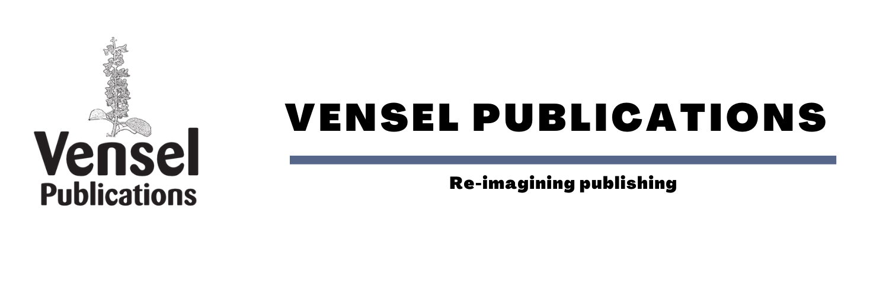

+++
title = "Author Instructions"
description = "Intructions for authors to format and author their manuscript."

+++

Vensel Publications is a publisher of scholarly open access journals. All journals uphold a peer-reviewed, rapid, and rigorous manuscript handling and editorial process.

Our journals are the perfect place for you to publish your work under an open access license, in a fast and straightforward manner. Our journals are indexed in the leading databases and, since they are open access, have a broad readership.

As a pioneer open access publisher, our mission is to make new research findings accessible to everyone. We are serving scholars from across the globe and from a variety of backgrounds. To deepen our understanding of the research communities that we serve, we aim to build journals that are just as diverse and inclusive. Only by valuing differences can we create an equitable and inclusive work environment and foster the openness that is key to our mission.

{}